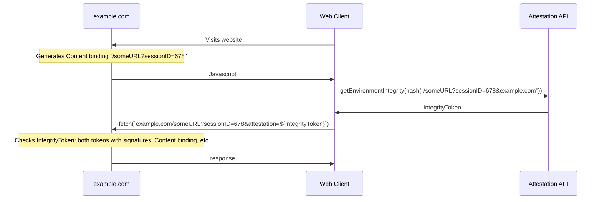

# Web Environment Integrity Explainer

## Authors:

- Ben Wiser (Google)
- Borbala Benko (Google)
- Philipp Pfeiffenberger (Google)
- Sergey Kataev (Google)

## Participate
- [Issue tracker](https://github.com/RupertBenWiser/Web-Environment-Integrity/issues)

## Table of Contents

- [Introduction](#introduction)
- [Web environment integrity](#web-environment-integrity)
- [Goals](#goals)
- [Non-goals](#non-goals)
- [Example use cases](#example-use-cases)
- [How it works](#how-it-works)
    - [What information is in the signed attestation?](#what-information-is-in-the-signed-attestation)
- [How can I use web environment integrity?](#how-can-i-use-web-environment-integrity)
- [Challenges and threats to address](#challenges-and-threats-to-address)
    - [Quality of attesters](#quality-of-attesters)
    - [Tracking users’ browser history](#tracking-users-browser-history)
    - [Fingerprinting](#fingerprinting)
    - [Cross-site tracking](#cross-site-tracking)
- [Detailed design discussion](#detailed-design-discussion)
    - [Why not use JWTs instead of CBOR?](#why-not-use-jwts-instead-of-cbor)
    - [How does this affect browser modifications and extensions?](#how-does-this-affect-browser-modifications-and-extensions)
- [Considered alternatives](#considered-alternatives)
    - [Make this an extension of the fetch API](#make-this-an-extension-of-the-fetch-api)
    - [Privacy Pass / Private Access Tokens](#privacy-pass--private-access-tokens)
- [Open questions](#open-questions)
    - [How will we prevent this signal from being used to exclude vendors?](#how-will-we-prevent-this-signal-from-being-used-to-exclude-vendors)
        - [Holdback](#holdback)
        - [Attester-level acceptable browser policy](#attester-level-acceptable-browser-policy)
- [How are WebViews different?](#how-are-webviews-different)
- [Stakeholder feedback / opposition](#stakeholder-feedback--opposition)
- [References & acknowledgements](#references--acknowledgements)

## Introduction

Users often depend on websites trusting the client environment they run in. This trust may assume
that the client environment is honest about certain aspects of itself, keeps user data and
intellectual property secure, and is transparent about whether or not a human is using it. This
trust is the backbone of the open internet, critical for the safety of user data and for the
sustainability of the website’s business.

Some examples of scenarios where users depend on client trust include:
- Users like visiting websites that are expensive to create and maintain, but they often want or
need to do it without paying directly. These websites fund themselves with ads, but the advertisers
can only afford to pay for humans to see the ads, rather than robots. This creates a need for human
users to prove to websites that they're human, sometimes through tasks like challenges or logins.
- Users want to know they are interacting with real people on social websites but bad actors often
want to promote posts with fake engagement (for example, to promote products, or make a news story
seem more important). Websites can only show users what content is popular with real people if
websites are able to know the difference between a trusted and untrusted environment.
- Users playing a game on a website want to know whether other players are using software that
enforces the game's rules.
- Users sometimes get tricked into installing malicious software that imitates software like their
banking apps, to steal from those users. The bank's internet interface could protect those users if
it could establish that the requests it's getting actually come from the bank's or other trustworthy
software.

The trust relationship between websites and clients is frequently established through the collection
and interpretation of highly re-identifiable information. However, the signals that are considered
essential for these safety use cases can also serve as a near-unique fingerprint that can be used to
track users across sites without their knowledge or control.

We would like to explore whether a lower-entropy mechanism - Web Environment Integrity - could help
address these use cases with better privacy respecting properties.

## Web environment integrity

With the web environment integrity API, websites will be able to request a token that attests key
facts about the environment their client code is running in. For example, this API will show that a
user is operating a web client on a secure Android device. Tampering with the attestation will be
prevented by signing the tokens cryptographically.

Websites will ultimately decide if they trust the verdict returned from the attester. 
It is expected that the attesters will typically come from the operating system (platform) as a
matter of practicality, however this explainer does not prescribe that. For example, multiple
operating systems may choose to use the same attester. This explainer takes inspiration from
existing native attestation signals such as
[App Attest](https://developer.apple.com/documentation/devicecheck/validating_apps_that_connect_to_your_server)
and the [Play Integrity API](https://developer.android.com/google/play/integrity). 

There is a tension between utility for anti-fraud use cases requiring deterministic verdicts and
high coverage, and the risk of websites using this functionality to exclude specific attesters or
non-attestable browsers. We look forward to discussion on this topic, and acknowledge the
significant value-add even in the case where verdicts are not deterministically available
(e.g. holdouts). 

## Goals

- Allow web servers to evaluate the authenticity of the device and honest representation of the
software stack and the traffic from the device.
- Offer an adversarially robust and long-term sustainable anti-abuse solution.
- Don't enable new cross-site user tracking capabilities through attestation.
- Continue to allow web browsers to browse the Web without attestation.

## Non-goals

- Enable reliable client-side validation of verdicts: Signatures must be validated server-side, as
client javascript may be modified to alter the validation result. 
- Enforce or interfere with browser functionality, including plugins and extensions.
- Access to this functionality from non-[Secure Contexts](https://www.w3.org/TR/secure-contexts/).

## Example use cases

- Detect social media manipulation and fake engagement.
- Detect non-human traffic in advertising to improve user experience and access to web content
- Detect phishing campaigns (e.g. webviews in malicious apps) 
- Detect bulk hijacking attempts and bulk account creation.
- Detect large scale cheating in web based games with fake clients
- Detect compromised devices where user data would be at risk
- Detect account takeover attempts by identifying password guessing

## How it works

There are a minimum of three participants involved in web environment integrity attestation:

- The web page executing in a user's web browser
- A third party that can “attest” to the device a web browser is executing on, referred to as the
attester
- The web developers server which can remotely verify attestation responses and act on this
information.

1. A web page requests an environment attestation from the attester with a "content binding". The
content binding ensures that even if an attacker intercepts an attestation, they can't use it to
attest to a modified request. The attestation is a low entropy description of the device the web
page is running on.
1. The attester will then sign a token containing the attestation and content binding (referred to
as the payload) with a private key. The attester then returns the token and signature to the web
page. The attester’s public key is available to everyone to request.
1. The webpage returns this information to the web server.  The web server then checks that the
token came from an attester it trusts and inspects the token’s payload. It verifies the payload by
verifying the signature with the attester’s public key.
1. Optionally, the web server may call the attester’s server endpoint to get additional
(low-entropy) signals, for example to detect potentially hyperactive devices.



### What information is in the signed attestation?

The proposal calls for at least the following information in the signed attestation:
- The attester's identity, for example, "Google Play".
- A verdict saying whether the attester considers the device trustworthy.

We're still discussing whether each of the following pieces of information should be included and
welcome your feedback:
-  The device integrity verdict must be low entropy, but what granularity of verdicts should we
allow? Including more information in the verdict will cover a wider range of use cases without
locking out older devices. A granular approach proved useful previously in the Play Integrity API.
- The platform identity of the application that requested the attestation, like com.chrome.beta,
org.mozilla.firefox, or com.apple.mobilesafari.
- Some indicator enabling rate limiting against a physical device

We strongly feel the following data should never be included:
- A device ID that is a unique identifier accessible to API consumers

## How can I use web environment integrity?

There are two steps to using web environment integrity for developers. The first step is to request
an environment integrity attestation on the web page and send it to the web server.

```js
// getEnvironmentIntegrity expects a “content binding” of the request you are
// about to make. The content binding protects against this information being
// used for a different request.
// The contentBinding will be concatenated with top-level domain name and hashed
// before it is sent to the attester.
const contentBinding = `/someRequestPath?requestID=xxxx` +
    "Any other data needed for a request-specific contentBinding...";

const attestation = await navigator.getEnvironmentIntegrity(contentBinding);

console.log(attestation.encode());
"<base-64 encoding of the attestation payload and signature approx 500 bytes; see below for details>"

// More on attestation validation below
const response = await fetch(`/someRequest?requestID=xxxx&attested=${attestation.encode()}`);
// Do something with this ...
```

The attestation token is returned using an ArrayBuffer serialized with CBOR (RFC 8949) and signed
using COSE (RFC 9052). Further information about the contents of the attestation token will be found
in the specification.

The second step is on your web server, where you verify that the attested information is
valid using the attester's public key, and then make decisions based on the
information reported.

```js
// None of the code below is part of the Web Environment Integrity API being
// proposed. This is an example of how you can verify the environment's integrity
// on your web server.
function isAttested(attestation, contentBinding) {
  if (!isAttesterTrustedByMe(attestation)) {
    return false;
  }

  // The attester's public key is retrieved directly from the attester.
  const attestersPublicKey = getAttestersPublicKey(attestation);

  // We then validate the attestation token using the attester's public key.
  // We also check the content binding and replay protection in the attestation.
  if (!isTokenRecentEnoughAndValid(attestersPublicKey, attestation)) {
    return false;
  }

  // Check contentBinding hash in attestation
  // Make decisions using the attestation.payload
  // ...
}
```

## Challenges and threats to address

### Quality of attesters

Web Environment Integrity does not prescribe a list of specific attesters or conditions the
attesters need to meet to become an attester. Browsers should publish their privacy requirements for
attesters, and allow websites to evaluate each attester’s utility on its own merit. Users should
also be given the option to opt out from attesters that do not meet their personal quality
expectations.

### Tracking users’ browser history

User agents will not provide any browsing information to attesters when requesting a token. We are
researching an issuer-attester split that prevents the attester from tracking users at scale, while
allowing for a limited number of attestations to be inspected for debugging—with transparency
reporting and auditability.

### Fingerprinting

This explainer requires the contents of the attestation payloads to be signed. Those contents cannot
be tampered with or else they will not be trustworthy. Only attesters can include information that
can identify users/devices.

All fields returned by attesters must be low-entropy so as not to be uniquely identifying. For
example, attesters may specify low/medium/high for a trust score instead of a continuous numeric
value. The attestation payloads will only include information about device and application integrity
as attesters will not have access to the profile information in applications.

How can we ensure attesters are not returning high entropy responses?
- In the near term for experimentation, the attester should publicly declare what they are attesting
to, with readable and verifiable verdicts.
- Beyond the experimentation phase, we need a verifiable method to enforce low entropy responses.
We would like to explore options like splitting the attester and token issuer functions from one
role to two independent organizations, where the token issuer can verify the attestation response
meets the entropy requirements. 

### Cross-site tracking

While attestation tokens will not include information to identify unique users, the attestation
tokens themselves could enable cross-site tracking if they are re-used between sites. For example,
two colluding sites could work out that the same user visited their sites if a token contains any
unique cryptographic keys and was shared between their sites.

The browser must enforce top-level partitioning for all attester tokens, so that no two domains can
conspire to track the user across sites using this mechanism. We also intend to limit linkability
between relying parties (websites requesting attestation) and the attester in a way that prevents
scaled tracking even if the attester were to collude with websites, while allowing for debugging of
broken attestations.

The partitioning will be different for different profiles (e.g. Incognito profiles get different
partitions even if it’s the same site the user visited on their regular profile). The user should
also be able to reset the state that produces these tokens, breaking linkability even within the
same partition.

The attestation metadata itself should strive for minimal entropy while providing useful confidence
levels, enumerations, and/or binary indicators.

## Detailed design discussion

### Why not use JWTs instead of CBOR?

When it comes to billion-qps traffic, the design needs to be mindful of the bandwidth overhead it
adds to users of the web. CBOR minimizes the payload size of requests while still decoding/encoding
to JSON.

[Web Authn](https://www.w3.org/TR/webauthn-2/) has already set a precedent to use CBOR. It makes
sense to use a similar attestation format in both specifications to encourage adoption.

### How does this affect browser modifications and extensions?

Web Environment Integrity attests the legitimacy of the underlying hardware and software stack, it
does not restrict the indicated application’s functionality: E.g. if the browser allows extensions,
the user may use extensions; if a browser is modified, the modified browser can still request Web
Environment Integrity attestation.

## Considered alternatives

### Make this an extension of the fetch API

Once a web client has performed an initial verification of the environment it runs in, it should
have more trust in running attestation requests locally. Decoupling attestation requests from fetch
allows web developers the opportunity to do these checks on calls that matter, without adding
overhead to the rest.

Developers can also use this API with web sockets. Introducing this API first as a primitive will
enable us to build on it at a later stage.

### Privacy Pass / Private Access Tokens
Apple and Cloudflare have developed
[Private Access Tokens](https://blog.cloudflare.com/eliminating-captchas-on-iphones-and-macs-using-new-standard/)
for a similar use case, and Chrome has also built technologies based on PrivacyPass (Private State
Tokens). However due to the fully-masked tokens, this technology assumes that the Attester can
produce sustainable, high-quality attestation without any feedback from web sites about gaps such
as false positives or false negatives.

We are convinced that the durability of a device attestation solution is a function of adversarial
pressure and the defender’s ability to continue hardening the system against the ever-evolving abuse
tactics and techniques. We are thus pursuing a solution that enables debugging of false positives
and false negatives while still preventing scaled tracking.

## Open questions

### How will we prevent this signal from being used to exclude vendors?

Providing a signal that is unique to the attester could be hazardous if websites decide to only
support attesters where certain signals are available. If websites know exactly what browser is
running, some may deny service to web browsers that they disfavor for any reason. Both of these go
against the principles we aspire to for the open web.

Attesters will be required to offer their service under the same conditions to any browser who
wishes to use it and meets certain baseline requirements. This leads to any browser running on the
given OS platform having the same access to the technology, but we still have the risks that 1) some
websites might exclude some operating systems, and 2) if the platform identity of the
application that requested the attestation is included, some websites might exclude some browsers.

#### Holdback

To protect against both risks, we are evaluating whether attestation signals must sometimes be held
back for a meaningful number of requests over a significant amount of time (in other words, on a
small percentage of (client, site) pairs, platforms would simulate clients that do not support this
capability). Such a holdback would encourage web developers to use these signals for aggregate
analysis and opportunistic reduction of friction, as opposed to a quasi-allowlist: A holdback would
effectively prevent the attestation from being used for gating feature access in real time, because
otherwise the website risks users in the holdback population being rejected.

Although a holdback would prevent the attestation signal from being used for per-request enforcement
decisions, there remains immense value for measurement in aggregate populations. 

However, a holdback also has significant drawbacks. In our use cases and capabilities survey, we
have identified a number of critical use cases for deterministic platform integrity attestation.
These use cases currently rely on client fingerprinting. A deterministic but limited-entropy
attestation would obviate the need for invasive fingerprinting here, and has the potential to usher
in more privacy-positive practices in the long-term.

We ask for feedback from the community group on the idea of a holdback, and are very interested in
alternative suggestions that would allow both goals to be met.

#### Attester-level acceptable browser policy

If the community thinks it's important for the attestation to include the platform identity of the
application, and is more concerned about excluding certain browsers than excluding certain
OS/attesters, we could standardize the set of signals that browsers will receive from attesters,
and have one of those signals be whether the attester recommends the browser for sites to trust
(based on a well-defined acceptance criteria). As new browsers are introduced, they would need to
demonstrate to attesters (a relatively small group) that they pass the bar, but they wouldn't need
to convince all the websites in the world. Established browsers would need to only use attesters
that respond quickly and fairly to new browsers' requests to be trusted.

## How are WebViews different?

WebViews are embedded into native apps which have direct access to attestation APIs that expose more
information than we'd be willing to provide on the web. These apps can expose direct access to those
APIs, so it makes sense to relax some of the restrictions we propose for the Web APIs above. In
particular:

- The WebView API doesn't have the same concerns regarding vendor lock-in.
- The WebView API can expose information about the embedder's application under certain conditions
(for example, opt-in).

## Stakeholder feedback / opposition

[Implementers and other stakeholders may already have publicly stated positions on this work. We
will list them here with links to evidence as appropriate.]

- [Implementor A] : Positive
- [Stakeholder B] : No signals
- [Implementor C] : Negative

[When appropriate, we will explain the reasons given by other implementers for their concerns.]

## References & acknowledgements

Many thanks for valuable feedback and advice from:

- [Nick Doty](https://github.com/npdoty) for helping identify user concerns in an [early proposal](https://github.com/antifraudcg/proposals/issues/8).
